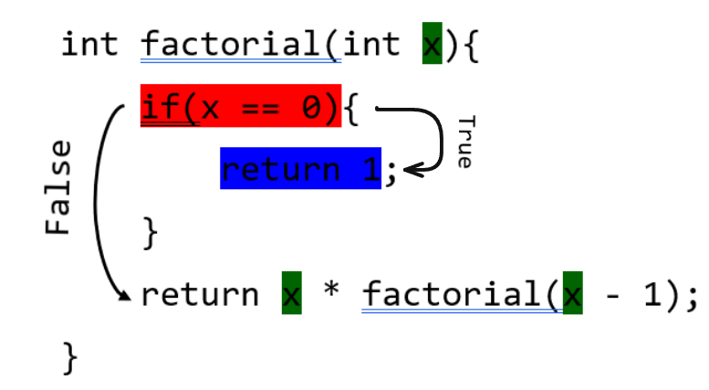
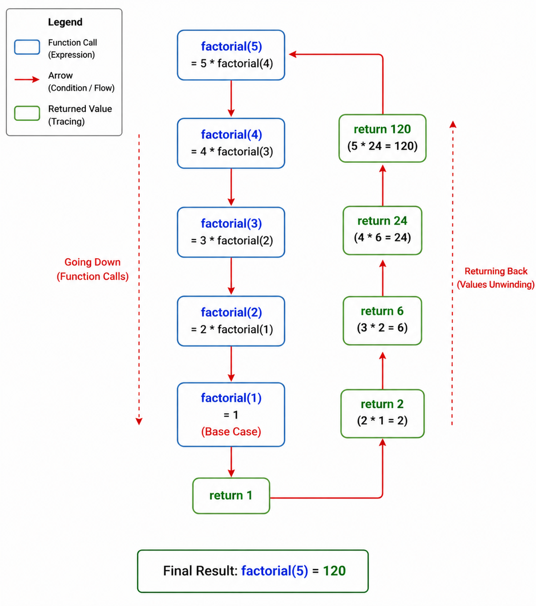
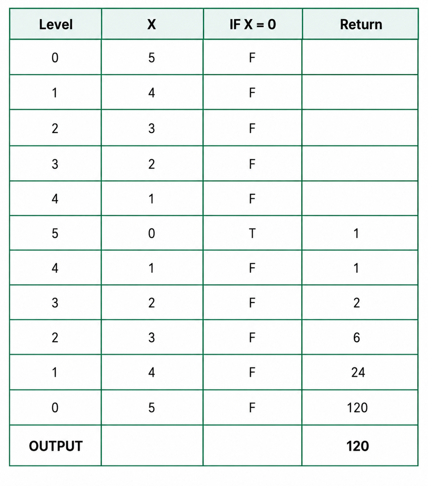

# Code Tracing

Code tracing is a reverse engineering technique used to understand the flow of data, variables, functions, and control structures within a program. By following the execution path step by step, developers can analyze how information is processed, identify logical errors, and gain insights into program behavior.

---

## Steps of Code Tracing

- Highlight the expressing (use blue color).
- Use the arrows to show the order of
  execution.
- Use comments (True or False) to show conditions.
- Follow the program and fill in the record table from specific variable.

---

## Use appropriate color swatch (RGB)

- **Expression** --> <span style="color:blue">Blue</span>

- **Arrow, Condition** --> <span style="color:red">Red</span>

- **Variable (Tracing)** --> <span style="color:green">Green</span>

---

## Code Tracing: Factorial(5) Using Recursion

### code

```
int factorial(int x){
    if(x == 0){
        return 1;
    }

    return x * factorial(x - 1);
}

int main()
{
    int n = 5;
    int fact = factorial(n);

    printf("Factorial of %d is %d\n", n, fact);

    return 0;
}
```

### `Highlighting:`



---

### `Function Call Tree:`

## 

### `Tracing Table:`



---
